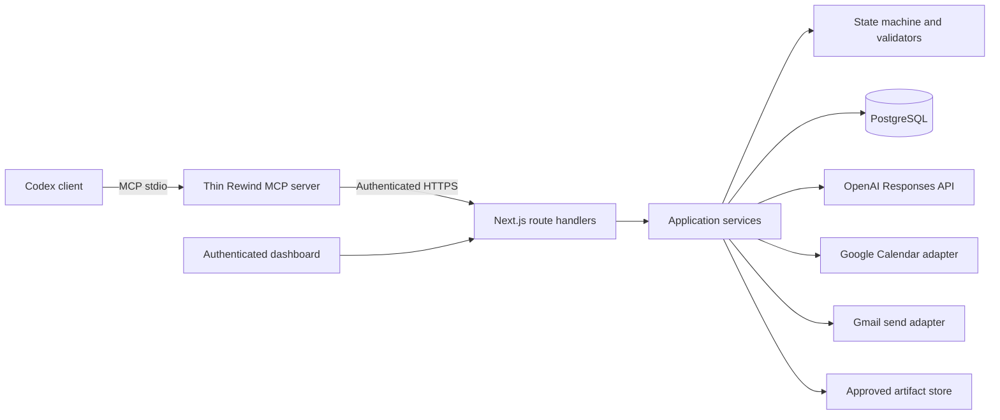
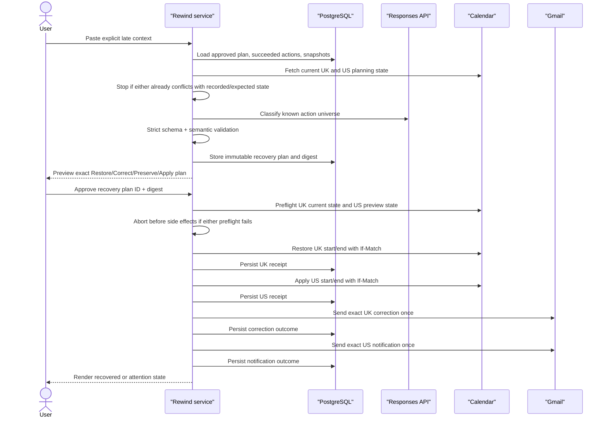
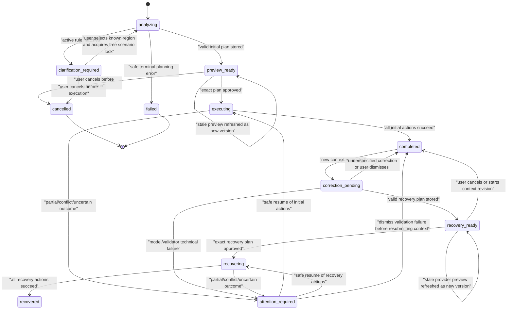

# Rewind MVP architecture

| Field | Value |
|---|---|
| Status | Approved target architecture |
| Scope | Single-tenant, single-scenario hackathon MVP |
| Runtime | One TypeScript application plus a thin MCP process |
| Database | PostgreSQL from the foundation phase |
| Last updated | 2026-07-15 |

This document owns how the PRD is implemented. It does not broaden product scope. Exact interface fields live in `CONTRACTS.md`; safety invariants in `SAFETY.md` override convenience.

## 1. Architectural principles

1. **Recorded lineage, not inferred universal causality.** Dependency edges are part of the immutable approved plan.
2. **The model proposes; deterministic code disposes.** Models produce strict intent/classification objects. Only allowlisted code builds external calls.
3. **Approval names an immutable object.** Approval binds one exact plan digest, not a mutable task.
4. **External execution is a durable saga, not a transaction.** Persist every action boundary and expose partial or uncertain outcomes.
5. **At-most-once irreversible effects.** Do not auto-retry an ambiguous Gmail send.
6. **Optimistic concurrency for reversible state.** Calendar changes use ETags and fail on drift.
7. **One active effect-bearing scenario.** Serialize planning/execution/reset, while allowing a rule-matched clarification-only intake that has no plan, action, or lock.
8. **One package.** Add a package/workspace boundary only if a proven deployment constraint requires it.
9. **No silent fallback.** Provider, model, or validation failures remain visible and cannot become a fake success.

## 2. Runtime topology



Codex calls only Rewind's high-level `create_world_pr` tool. It never receives Google credentials and never calls Calendar or Gmail directly. Dashboard and MCP creation converge on the same `createWorldPr` application service.

Local Codex clients support stdio MCP servers; a future remote transport is not required for the MVP. The MCP process is a thin authenticated HTTP client and owns no product state. See the current [Codex MCP documentation](https://learn.chatgpt.com/docs/extend/mcp).

## 3. Intended source layout

```text
app/
  page.tsx
  pr/[worldPrId]/page.tsx
  api/
components/
  world-pr/
  execution/
  causal-revert/
  prevention/
lib/
  contracts/       # Zod schemas, DTOs, error codes, template registry
  domain/          # State machine, plan hashing, validators, policies
  services/        # create, approve, execute, recover, rule, reset use cases
  ai/              # Prompt/schema versions and Responses API client
  adapters/
    calendar.ts
    gmail.ts
    artifact.ts
  db/              # Queries and migrations
  auth/             # Dashboard session, CSRF, MCP bearer auth
mcp/server.ts
db/migrations/
scripts/
  seed-demo.ts
  preflight-demo.ts
  reset-demo.ts
evals/recovery/
tests/{unit,integration,e2e}/
```

Do not add a generic `RewindableAction` interface. Calendar restoration and mail correction have materially different semantics and should remain explicit.

## 4. Component responsibilities

| Component | Owns | Must not own |
|---|---|---|
| Route handlers | Auth, CSRF, request validation, result-to-HTTP mapping | Business rules or provider orchestration |
| Application services | Use-case ordering and durable boundaries | Raw unvalidated provider/model data |
| Domain | State transitions, plan digest, dependency and recovery validation, allowlist policy | Network calls |
| PostgreSQL | Tasks, immutable plans, approvals, action ledger, artifacts, rules, audit events, scenario lock | Provider truth beyond stored snapshots/receipts |
| AI service | Propose bounded assumptions/dependency edges, account-brief content, correction intent, recovery classifications/templates, and typed rule copy | Recipient selection, arbitrary IDs, deterministic semantic validation, provider payloads, code |
| Calendar adapter | Fetch tagged candidates, typed snapshots, conditional start/end changes, verification | Gmail notifications or conflict rebasing |
| Gmail adapter | Build deterministic MIME from approved template, one send attempt, typed receipt | Reading/searching mailboxes, deleting/undoing mail, automatic retry after ambiguity |
| Artifact adapter | Store the exact approved account-brief bytes/hash/provenance and return a typed receipt | Generating/regenerating content or accepting event/region input |
| MCP process | Expose minimal tools and call backend with auth/idempotency | Approval, execution, Google credentials, database access |

## 5. Core flows

### 5.1 Create and execute a World PR

```mermaid
sequenceDiagram
    actor User
    participant Entry as "Dashboard or MCP"
    participant App as "Rewind service"
    participant DB as "PostgreSQL"
    participant Cal as "Calendar"
    participant AI as "Responses API"
    participant Mail as "Gmail"

    User->>Entry: Submit request
    Entry->>App: createWorldPr(request, idempotencyKey)
    App->>Cal: Fetch exactly two tagged candidates
    App->>DB: Load active typed guardrail
    alt Active guardrail matches
        App->>DB: Persist clarification-only intake (no plan/lock)
        App-->>User: Ask UK vs US through normal read model
    else No guardrail match
        App->>DB: Acquire scenario lock with planning lease; create task
        App->>App: Rank/select UK from nearest-upcoming provider fact
        App->>AI: Propose assumption, dependencies, and exact brief
        App->>App: Validate closed IDs/dependencies and brief content
        App->>DB: Store immutable plan, brief blob/hash, and digest
        App-->>User: Render World PR
    end
    User->>App: Approve exact plan ID + digest
    App->>DB: Store approval and create/claim action rows
    App->>DB: Persist the exact approved brief blob + provenance
    App->>Cal: Refetch; validate ETag/attendees; conditional update
    Cal-->>App: Updated event + receipt
    App->>DB: Persist Calendar after-state and receipt
    App->>Mail: Send exact approved UK notification once
    Mail-->>App: Message receipt or ambiguous error
    App->>DB: Persist mail outcome
    App-->>User: Render durable timeline
```

Artifact generation happens during planning and its exact content/hash is approved. Execution first persists that already-approved blob, so it never regenerates content and a local storage failure creates no external side effect. Gmail always follows successful reversible Calendar work. User-visible completion follows persisted action status.

### 5.2 Plan and execute recovery



All Calendar preflights happen before recovery's first side effect. Completed actions are skipped on resume. `recovered` is possible only after all approved recovery actions have succeeded.

## 6. Task and action state

### 6.1 Task status

```typescript
type TaskStatus =
  | "analyzing"
  | "clarification_required"
  | "preview_ready"
  | "executing"
  | "completed"
  | "correction_pending"
  | "recovery_ready"
  | "recovering"
  | "recovered"
  | "attention_required"
  | "cancelled"
  | "failed";
```

Approval is an immutable record/event, not a durable `approved` task state. Rule lifecycle is separate from task lifecycle, so activating a rule does not replace `recovered` with `rule_created`.



`attention_required` carries typed metadata:

```typescript
interface AttentionReason {
  stage: "initial" | "recovery" | "reset";
  kind:
    | "retryable_failure"
    | "delivery_uncertain"
    | "provider_conflict"
    | "validation_failure"
    | "permanent_failure"
    | "partial_reset";
  actionKey?: string;
}
```

### 6.2 Action status

```typescript
type ActionStatus =
  | "planned"
  | "in_progress"
  | "succeeded"
  | "retryable_failed"
  | "delivery_uncertain"
  | "conflict"
  | "permanently_failed";
```

The task status is derived from the plan phase and action ledger. Provider calls never infer success from an HTTP timeout or missing local response.

### 6.3 Rule status

```typescript
type PreventionRuleStatus = "proposed" | "active" | "removed";
```

## 7. PostgreSQL model

Use normalized lifecycle records and JSONB for immutable plan payloads and typed provider snapshots. This avoids premature schema expansion while preserving auditability.

| Table | Important fields | Invariants |
|---|---|---|
| `rewind_schema_migrations` | `migration_id`, `checksum`, `applied_at` | Technical ledger owned by `postgres`; one immutable checksum per migration ID; runtime role has read-only access |
| `tasks` | `id`, `run_id`, `request`, `status`, `attention_reason`, `planning_lease_until`, timestamps | UUID/opaque ID; clarification-only records may have no run/lock; no mutable plan payload |
| `scenario_locks` | `scenario_key`, `task_id`, `acquired_at`, `lease_until`, `execution_started_at` | One row for `acme-demo`; a planning lease is reclaimable only after proving no approval/action exists; effectful locks remain through successful reset |
| `plans` | `id`, `task_id`, `kind`, `version`, `schema_version`, `prompt_version`, `model`, `payload`, `digest`, `created_at` | Immutable; unique task/kind/version; digest over canonical payload |
| `approvals` | `id`, `plan_id`, `plan_digest`, `actor_id`, `approved_at` | Immutable; digest must equal current plan digest |
| `action_executions` | `id`, `plan_id`, `action_key`, `type`, `target_ref`, `status`, typed action/before/after, receipt, attempts, `lease_until`, `dispatch_started_at`, error, timestamps | Unique `(plan_id, action_key)`; status transition validated; Gmail marker precedes transport handoff |
| `artifacts` | `id`, `task_id`, `kind`, `content`, `content_hash`, `provenance`, timestamps | Content was generated/validated in the approved plan; execution persists the same bytes |
| `prevention_rules` | typed condition fields, display copy, source task, status, timestamps | No executable free-form condition; activation separately audited |
| `idempotency_records` | `actor_id`, `endpoint`, `key`, `body_hash`, `status`, `resource_id`, `response`, timestamps | Atomic claim; one logical submission; `in_progress | completed | failed` |
| `demo_event_state` | stable semantic baseline, `expected_etag`, `expected_updated_at`, last receipt | Baseline excludes mutable provider versions; expected version rolls after every verified write/reset |
| `audit_events` | `task_id`, `event_type`, redacted metadata, timestamp | Append-only product timeline; no secrets/PII bodies |

The foundation migration is applied through one migration-owner connection in a single transaction. The runner sets a deterministic `public, pg_catalog` search path, bounded lock/statement timeouts, and a transaction-scoped advisory lock before validating the ledger and executing SQL. It records the SHA-256 checksum only after the complete catalog matches the frozen expectation. A repeat run accepts only the same migration ID and checksum and revalidates the catalog; a checksum conflict, partial schema, or catalog drift fails closed. Once recorded, migration bytes are immutable and later changes use a new numbered migration.

The application runtime connects only as `rewind_app` over TLS. That role has `SELECT`, `INSERT`, `UPDATE`, and `DELETE` on the ten application tables, `SELECT` on the migration ledger, and `SELECT`/`USAGE` on the audit sequence. `PUBLIC` and the unused Supabase API roles have no effective table or sequence access. These foundation grants do not by themselves enforce every later domain immutability rule; application services and the later persistence gate must still enforce plan, approval, and audit semantics.

`GET /api/health` proves only that the process can answer HTTP. `GET /api/ready` additionally proves the restricted runtime connection, TLS, recorded migration checksum, and exact table/constraint catalog. Readiness failures are sanitized and return `503`; provider details remain server-side.

### Plan digest

Serialize the versioned plan payload with one canonical JSON implementation and hash it with SHA-256. Include exact targets, source versions, action keys, templates, dependency IDs, times, recipients, message bodies/hashes, exact artifact content/source/content hashes, and execution order. Do not include display-only volatile fields such as render timestamps.

On approval/execution, recompute and constant-time compare the digest. If relevant provider state changed, create a new plan version and require approval again rather than mutating the old plan.

## 8. External adapter semantics

### 8.1 Calendar

Supported event boundary:

- connected account owns the configured calendar;
- timed, non-recurring, non-all-day event;
- one explicit IANA time zone;
- exact private demo tag and known region;
- all intended recipients are allowlisted;
- Rewind changes only `start` and `end`.

Keep two different records: an immutable **semantic baseline** (stable event/calendar IDs, baseline start/end/time zone/duration, ownership/type, attendee/tag digests) and a rolling **expected provider version** (`etag`, `updated`). ETags are never part of the immutable baseline. Update the expected version after every verified move, restore, recovery write, and reset write.

Initial execution:

1. Fetch the event and typed snapshot immediately before approval rendering.
2. At execution, refetch and compare ID, ETag, ownership, event type, time zone, start/end, and attendee set.
3. Reject drift and invalidate approval.
4. Apply start/end with `If-Match` and `sendUpdates=none`.
5. Store the resulting ETag, start/end, and typed receipt.
6. Optionally refetch to verify the desired values.

Restore:

1. Refetch and require current ETag and changed fields to equal Rewind's recorded after-state.
2. Patch only start/end back to the original snapshot using `If-Match`.
3. Never overwrite descriptions, attendees, conference details, reminders, or human changes.
4. A `412` or mismatch is `conflict`; generic rebase is excluded.

Google documents ETags and `If-Match` for conditional Calendar modification, and `events.patch` supports partial updates plus `sendUpdates=none`: [resource versions](https://developers.google.com/workspace/calendar/api/guides/version-resources) and [events patch](https://developers.google.com/workspace/calendar/api/v3/reference/events/patch).

### 8.2 Gmail

The default MVP uses only the narrower `gmail.send` scope. Exact recipients, subject, body, and a unique run ID are part of the approved plan. The application builds MIME deterministically; the model does not create headers or recipients.

Execution policy:

1. Create/claim a unique action row before calling Gmail.
2. Recheck plan digest and recipient allowlist.
3. Build and validate MIME, acquire a valid token, and finish all local preparation while `dispatch_started_at` is null.
4. Persist `dispatch_started_at` before handing the request to the HTTP transport, then attempt `messages.send` once.
5. A valid 2xx response with a message ID is `succeeded`. An explicit non-timeout 4xx rejection is `permanently_failed` and is not automatically retried.
6. Any transport exception after handoff, client/server timeout, cancellation, malformed 2xx, HTTP 408/429/5xx, or process death after `dispatch_started_at` is `delivery_uncertain`; do not resend automatically.
7. Only a failure proven to occur while `dispatch_started_at` is still null (local schema/MIME/allowlist/token preparation) may be `retryable_failed`.

This is at-most-once policy, not exactly-once delivery; Gmail's send method exposes no application idempotency token. A draft-based approach would improve some reconciliation cases but requires the broader restricted `gmail.compose` scope and is rejected for this MVP. See [Create and send email messages](https://developers.google.com/workspace/gmail/api/guides/sending) and [`users.messages.send`](https://developers.google.com/workspace/gmail/api/reference/rest/v1/users.messages/send).

### 8.3 Artifact

The account brief is model-generated during planning from one versioned, seeded parent-account source. The source ID/hash and exact output/content hash are stored in the immutable plan. No selected event, region, attendee, time, or provider result enters the generation input. A closed validator also rejects output containing a known region, event/candidate ID or title, attendee, meeting time/date, or unsupported claim. The UI shows the full brief before approval. The artifact adapter is a storage adapter: execution creates the active artifact record from the exact approved bytes/hash and never generates or regenerates content. If input independence, output validation, or byte/hash equality cannot be proved, `preserve` is invalid and recovery planning fails closed.

### 8.4 Prevention rule

The engine supports one typed predicate:

```typescript
interface AcmeRegionAmbiguityRule {
  type: "calendar_company_region_ambiguity";
  company: "Acme";
  minimumMatches: 2;
  disambiguationField: "region";
  protectedActions: ["calendar.move", "mail.notify"];
  scope: "demo_workspace";
  status: "proposed" | "active" | "removed";
}
```

Natural-language copy is display-only. An active rule runs between candidate retrieval and selection and can only cause `ask_for_confirmation`.

The post-recovery **Try guardrail** UI submits to normal `POST /world-prs`. Candidate lookup and rule evaluation precede lock acquisition. A match persists a clarification-only intake with the question/candidates but no plan/action and no scenario lock, so it is reachable while the original recovered run still owns the effect-bearing lock. The demo does not resolve that intake. Successful reset archives it and removes the rule for the next rehearsal.

## 9. AI/deterministic boundary

### Model may propose

- an assumption statement and selected candidate from the supplied closed candidate universe;
- dependency edges from supplied assumption IDs to supplied action IDs;
- the exact account brief within the closed artifact schema and approved source facts;
- corrected target ID from explicit new context and known candidates;
- `restore | correct | preserve` classifications for supplied executed IDs;
- the two allowed new-action template IDs;
- a prevention-rule proposal using the one allowed typed rule shape, plus user-facing reasons/copy.

### Deterministic code owns

- candidate retrieval and candidate universe;
- provider-grounded ranking facts and the requirement that the controlled initial proposal resolves to the nearest upcoming UK candidate;
- the allowed assumption/action universes and semantic checks for the proposed dependency graph;
- artifact source provenance, output leakage checks, content hashing, and byte-for-byte persistence;
- exact action universe, target IDs, recipients, time math, message templates, provider payloads, and order;
- compatibility matrix between action type/status and recovery outcome;
- the executable bounds of the typed prevention rule;
- approval/digest, allowlist, ETag, idempotency, action leasing, execution, verification, and reset;
- schema and semantic validation.

Use the OpenAI Responses API with strict Structured Outputs. Treat refusal, truncation, missing parsed output, or schema mismatch as a planning failure. Retry once with validation errors. A deterministic scenario fallback may exist behind a disabled development flag for fault testing, but must not run during the recorded demo or appear as model reasoning.

This preserves the brief's four meaningful reasoning tasks—assumption extraction, dependency mapping, recovery classification, and typed rule generalization—inside closed, validated universes. GPT proposes what the relationships mean; deterministic code controls every provider effect.

Current OpenAI guidance recommends Responses for text-generation applications and Structured Outputs over JSON mode; GPT-5.6 Sol currently lists both Responses and Structured Outputs support: [Responses guidance](https://developers.openai.com/api/docs/guides/text?api-mode=responses), [Structured Outputs](https://developers.openai.com/api/docs/guides/structured-outputs), and [GPT-5.6 Sol](https://developers.openai.com/api/docs/models/gpt-5.6-sol).

## 10. Idempotency, serialization, and resume

- Require `Idempotency-Key` on every mutating HTTP endpoint.
- Atomically claim `(actor, endpoint, key)` with the canonical body hash before saga work. Records move through `in_progress | completed | failed` and carry the resource/request ID from the first transaction.
- A concurrent identical request returns `200` with that existing resource's current durable state (and `replayPending: true` while the first call runs); it never enters the saga. A different body returns `409 idempotency_conflict`. Dashboard code creates one key per logical submission and reuses it across double-click/network retries.
- A safe terminal failure before any external-effect marker stores a redacted canonical error under that key. Identical replay returns the same stored error; a deliberate new submission uses a new key.
- Run candidate lookup and the active-rule precheck before locking. A matching clarification record has no plan/action and owns no lock.
- Use one `scenario_locks` row to reject a second request only when it tries to begin effect-bearing planning or resolve a clarification while another run owns the lock.
- Acquire the row with a planning lease. An expired planning/analyzing owner may be marked failed and released only after a transaction proves there is no approval, action row, or external-effect start marker. Inject/reconcile crashes after acquisition, task creation, Calendar read, model call, and plan persistence.
- Release the lock on cancellation/safe failure before execution. After an approval or action row exists, never reclaim it by lease alone; retain it through completion/attention/recovery until the approved reset workflow finishes.
- Use a unique `(plan_id, action_key)` constraint to prevent duplicate logical execution.
- Claim actions with a short DB lease/row lock before provider calls.
- Persist `in_progress` before dispatch and the outcome immediately after return.
- A repeated approve/resume request skips `succeeded`, blocks `delivery_uncertain`/`conflict`, and claims only known retryable/planned actions.
- When a lease expires in `in_progress`, reconcile by action type before any retry: Calendar either confirms the desired state, proves the untouched approved before-state, or marks conflict; artifact generation reconciles by its unique action/source key; Gmail becomes `delivery_uncertain` because dispatch cannot be disproved.
- Never use a browser request, page refresh, or task-level status alone as proof an external action has not run.

## 11. Failure semantics

| Condition | Durable outcome | User behavior |
|---|---|---|
| Invalid/unknown model output after one retry | `attention_required.validation_failure` | Show safe planning failure; no external action |
| Calendar ETag or attendee drift before first action | New preview required | Invalidate approval; no external action |
| Calendar `412` during execution | Action `conflict` | Stop; show changed event; no blind retry |
| Local Gmail preparation/token failure while `dispatch_started_at` is null | `retryable_failed` or validation failure | Retry only before transport handoff |
| Explicit non-timeout Gmail 4xx rejection | `permanently_failed` | Stop; never silently retry |
| Gmail 408/429/5xx, transport error, cancellation, malformed 2xx, or timeout after handoff | `delivery_uncertain` | Stop; do not resend automatically |
| Process dies with Gmail action `in_progress` | `delivery_uncertain` after lease expiry | Stop; dispatch cannot be disproved |
| Process dies with Calendar action `in_progress` | Reconcile approved before/desired state and ETags | Confirm success, retry only proven untouched state, or conflict |
| Initial Calendar succeeds, Gmail known-fails | Task `attention_required` | Preserve receipts; resume safe incomplete action only |
| Any recovery Calendar preflight fails | `attention_required.provider_conflict` | Send no recovery mail |
| Recovery partially succeeds | `attention_required` | Show exact completed and incomplete effects; resume safe actions only |
| Reset preflight conflict | `attention_required` at reset stage | Zero reset writes; keep lock and create a new reset plan |
| Reset race/partial write | `attention_required` with per-event receipts/current ETags | Never claim reset; keep lock; require an exact new reset plan |

No state named `completed` or `recovered` is allowed when an approved action is not `succeeded`.

## 12. Authentication and trust boundaries

- MCP authenticates with a scoped server-side bearer secret and can create/read only.
- Dashboard uses an authenticated SameSite HTTP-only session and CSRF protection for mutations.
- World PR IDs have at least 128 bits of entropy, but ID secrecy is not authorization.
- Google and OpenAI secrets remain server-side and encrypted/managed by the deployment secret facility.
- Approval actor identity is the authenticated demo operator.
- Provider adapters re-enforce target ownership and recipient allowlisting at the final execution boundary.

The exact demo authentication implementation is a foundation-phase decision, but these properties are not optional.

## 13. Reset semantics

Reset is another conditional workflow, not database cleanup masquerading as external recovery:

1. Ensure no execution is in progress.
2. Refetch both tagged events and build an immutable reset plan containing their current rolling ETags plus the exact semantic baseline start/end/time zone/duration for each event.
3. Render the complete reset plan, plan digest, and sent-mail warning; store a separate authenticated approval of that digest.
4. Before the first write, refetch and validate **both** events against the approved plan, including ETags and every controlled-boundary field. Any mismatch causes zero reset writes.
5. Patch each event's start/end with its approved `If-Match`, persisting the resulting receipt/ETag immediately. A race can still cause a partial reset; report `attention_required`, keep the lock, and require a newly rendered/approved reset plan for remaining work. Never claim atomicity.
6. After both are verified at their semantic baselines, replace the rolling expected ETags with the newly returned versions.
7. Archive the task/action ledger and guardrail-proof clarification record; retain audit receipts for the retention window.
8. Remove/deactivate the scenario's generated artifact and prevention rule.
9. Release the scenario lock and generate a new run ID.

Sent Gmail messages remain immutable audit residue. Subjects include the run ID so five repetitions remain distinguishable.

## 14. Observability

Use structured logs keyed by `requestId`, `taskId`, `runId`, `planId`, and `actionKey`. Log transitions, provider operation type, latency, status class, retry count, validation code, and redacted receipt ID. Do not log secrets, full prompts, event descriptions, attendee addresses, or mail bodies.

The in-product timeline comes from durable `audit_events` and action rows, not ephemeral logs.

Minimum operational counters for the demo:

- tasks by final status;
- action outcomes by type;
- duplicate/idempotency replays blocked;
- model schema/semantic retries;
- unknown ID/template/recipient rejections;
- provider conflicts and uncertain deliveries;
- reset success/conflict;
- five-run gate results.

No analytics product UI is required.

## 15. Runtime and deployment constraints

- PostgreSQL must exist from the foundation phase; do not plan a later SQLite migration.
- Planning, approval execution, recovery, resume, and reset requests run their short persisted sagas synchronously and return the resulting durable state. GET may observe an in-flight `executing`/`recovering` state, but no fire-and-forget work continues after a response.
- Select a host during the foundation phase that allows the longest approved execution route to complete or be safely resumed within its request limits.
- Local development and deployed dashboard must use the same application-service code.
- The deployed Google OAuth redirect URI, secure cookies, MCP base URL, and review URL must be proven before UI polish.

## 16. First vertical slice

The first implementation contains no live Calendar, Gmail, recovery, or AI call:

1. authenticated MCP `create_world_pr` receives a request;
2. backend validates input and idempotency key;
3. a test/development-only deterministic adapter supplies the two controlled candidates, rule result, and a complete contract-valid fixture plan;
4. PostgreSQL stores the task and immutable fixture-backed plan;
5. MCP returns `worldPrId`, `preview_ready`, and a non-secret review URL;
6. authenticated dashboard loads that complete review record;
7. duplicate create replays the same response;
8. unauthorized and second-active-scenario requests fail correctly;
9. deployed live mode refuses to start if any fake adapter is selected.

Only after this slice is tested may the provider/model risk-retirement phase begin. An incomplete placeholder remains `analyzing`; it is never exposed as `preview_ready`.
